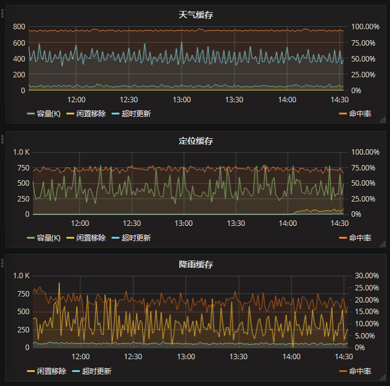
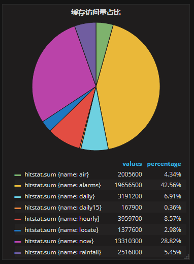

## ACache - 异步缓存框架，基于Akka实现

#### 例一、最简单的应用: 本地缓存

##### 1、使用本地缓存
```java
@Component
@Transactional
public class PushTargetService {

    @Autowired
    PushTargetDao pushTargetDao;

    @Autowired
    CacheService<String, PushTarget> cacheService;

    private PushTarget save(PushTarget pt) {
        PushTarget n = pushTargetDao.save(pt);
        cacheService.markDirty(pt.getUserId());  //保存数据记录后将其标记为过期
        return n;
    }

    public Future<PushTarget> find(String userId) {
        return cacheService.get(userId);
    }
}
```

##### 2、缓存初始化

```java
@Component
public class PushTargetCacheFactory {
    @Autowired
    ActorSystem system;

    @Autowired
    PushTargetDao pushTargetDao;

    @Bean(name = "pushTargetCache")
    public CacheService<String, PushTarget> createCacheService() {
        PushTargetCacheSource source = new PushTargetCacheSource();
        ActorRef ref = system.actorOf(CacheActor.props(source), "pushTargetCache");
        return new CacheService<PushTargetKey, PushTarget>(ref, system.dispatcher(), 5000);
    }

    class PushTargetCacheSource implements IDataSource<String, PushTarget> {
        @Override
        public Future<TimedData<PushTarget>> request(ActorRef actorRef, String cacheName, String userId) {
            PushTarget t = pushTargetDao.findByProductAndUserId(userId);
            long expiredTime = System.currentTimeMillis() + 3600_000;
            return Futures.successful(new TimedData<>(expiredTime, t));
        }
        @Override
        public String getCacheName() {
            return "pushTargetCache";
        }
        //acache是否等待IDataSource返回，true则等待最新结果返回给调用者，false则在request新数据的同时直接将缓存中已过期的结果返回给调用者
        public boolean waitForRespond() { 
            return true;
        }
        public long getIdleTimeout(PushTargetKey key) { //数据闲置时间
            return 1800_000L; //30分钟
        }
        public long getIdleCleanPeriod() { //过期数据及闲置数据的清理周期
            return 600_000L;//10分钟
        }
    }
}
```

#### 例二、作为缓存服务

缓存服务的创建过程同上，以下创建引用远程缓存服务的客户端

```java
class Test {
    @Bean
    public CacheAsker<String, PushTarget> createCacheClient() {
        String path = "akka.tcp://system@127.0.0.1:7300/user/pushTargetCache";
        ActorSelection sel = system.actorSelection(path);
        return new CacheAsker<>(sel, system.dispatcher(), 5000);
    }
}
```

#### 例三、级联缓存服务与本地缓存

有时候我们需要在多台服务器上使用缓存，但又不想给数据源带来多倍的访问量，
这时可以在缓存服务器和多台业务服务器分别创建ACache缓存，
并将缓存服务作为业务服务的二级缓存数据源，缓存服务的创建过程还是相同

```java
class Test {
    @Bean
    public CacheAsker<String, PushTarget> createCacheClient() {
        ICacheConfig<WeatherKey> cacheConfig = new ICacheConfig<WeatherKey>() {
            @Override
            public String getCacheName() {
                return "pushTargetLocalCache";
            }
            public boolean waitForRespond() {
                return true;
            }
            public long getIdleTimeout(WeatherKey key) {
                return 1800_000L; //30分钟
            }
            public long getIdleCleanPeriod() {
                return 600_000L; //10分钟
            }
        };
        List<String> remoteCachePaths = new LinkedList<>();
        remoteCachePaths.add("akka.tcp://system@127.0.0.1:7300/user/pushTargetCache");
        return LocalCacheCreator.createLocalCache(system, config, paths, timeout, timeout);
    }
}
```

#### 支持缓存监控

 

缓存对象创建时允许传入一个IHitStat接口的实现，缓存在被访问时会根据命中情况调用此接口方法，接口定义:
```java
public interface IHitStat<Key> {
    default void onRequest(Key key){}       //请求, 请求数 = Hit + Expired + Miss
    default void onHit(Key key){}           //命中
    default void onExpired(Key key){}       //过期
    default void onMiss(Key key){}          //未命中
    default void onIdleRemoved(Key key){}   //闲置移除
    default void onExpiredRemoved(Key key){}//超时移除
    default void setSize(long size) {}      //缓存条数
}
```

AbstractHitStatService实现了此接口，生成InfluxDB的日志格式，从此类继承只要实现写InfluxDB的post请求：

```java
@Component("locateHitStatService")
public class LocateHitStatService extends AbstractHitStatService<LocateRequest> {
    private static final Logger logger = LogManager.getLogger(LocateHitStatService.class);
    private final String dbUrl = "http://10.79.186.100:8086/write?db=tianqi"; //InfluxDB接口地址

    @Autowired
    private ActorSystem system;

    @Value("${httpclient.askTimeout}")
    private int askTimeout;

    @Resource(name = "logHttpClient")
    private FuturedHttpClient logHttpClient;

    protected void doWriteLogs(String lines) {
        HttpPost post = new HttpPost(dbUrl);
        post.setEntity(new StringEntity(lines, "UTF-8"));
        logHttpClient.ask(new HttpAsk("request", post), askTimeout).onComplete(
            new OnComplete<HttpResult>() {
                @Override
                public void onComplete(Throwable ex, HttpResult ret) {
                    if (ex == null) {
                        if (ret.error == null) {
                            int code = ret.response.getStatusLine().getStatusCode();
                            if (code != 204 && code != 200) {
                                logger.warn("Write cache hit stat data failed, result={}", ret.value);
                            }
                        } else {
                            logger.warn("Write cache hit stat data failed", ret.error);
                        }
                    } else {
                        logger.warn("Write cache hit stat data failed", ex);
                    }                        
                }
            }, system.dispatcher());
    }
}
```
